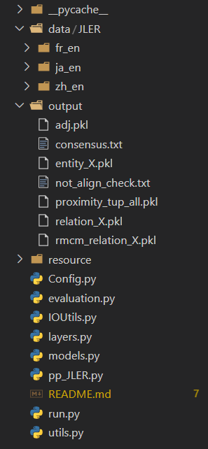

<!--
 * @Author: error: git config user.name && git config user.email & please set dead value or install git
 * @Date: 2022-12-01 18:28:20
 * @LastEditors: error: git config user.name && git config user.email & please set dead value or install git
 * @LastEditTime: 2022-12-02 15:41:25
 * @FilePath: /REGCN/README.md
 * @Description: 
 * 
 * Copyright (c) 2022 by error: git config user.name && git config user.email & please set dead value or install git, All Rights Reserved. 
-->

# REGCN 

This repo provides a reference implementation of **REGCN** as described in the paper:

> Yang, J., Zhou, W., Wei, L., Lin, J., Han, J., Hu, S. (2020). [RE-GCN: Relation Enhanced Graph Convolutional Network for Entity Alignment in Heterogeneous Knowledge Graphs](https://doi.org/10.1007/978-3-030-59416-9_26). In: Nah, Y., Cui, B., Lee, SW., Yu, J.X., Moon, YS., Whang, S.E. (eds) Database Systems for Advanced Applications. DASFAA 2020. Lecture Notes in Computer Science(), vol 12113. Springer, Cham. https://doi.org/10.1007/978-3-030-59416-9_26

## Basic Usage

## Code reference

- Config.py：实验参数配置。
- evaluation.py：提供测试中的距离、准确率计算功能。
- IOUtils.py：文件读写模块。
- layers.py：模块化GCN。
- model.py：REGCN模型。
- pp_JLER.py：提供数据预处理功能，包含数据集分割、训练、测试。
- run.py：实验入口程序。
- utils.py：工具箱，多个功能实现。文件未处理，可能包含了多个其他实验过程所需代码。

### Run the code
由于这是后期其他同学帮忙整理出的代码，代码虽然可以跑通，但是不能保证实验结果完全相同。

运行前需要将数据与代码组织成如下结构：
    <center>  </center>


```shell
cd ./REGCN

# run the model 
python run.py 

```

## Datasets

the datasets could be found in the following links: [REGCN_data](https://drive.google.com/drive/folders/198mvX8iQR-AzifuHdIpt18yggxy-NYn4?usp=sharing)


## Cite

If you find **REGCN** useful for your research, please consider citing us :

    @InProceedings{10.1007/978-3-030-59416-9_26,
        author="Yang, Jinzhu
        and Zhou, Wei
        and Wei, Lingwei
        and Lin, Junyu
        and Han, Jizhong
        and Hu, Songlin",
        editor="Nah, Yunmook
        and Cui, Bin
        and Lee, Sang-Won
        and Yu, Jeffrey Xu
        and Moon, Yang-Sae
        and Whang, Steven Euijong",
        title="RE-GCN: Relation Enhanced Graph Convolutional Network for Entity Alignment in Heterogeneous Knowledge Graphs",
        booktitle="Database Systems for Advanced Applications",
        year="2020",
        publisher="Springer International Publishing",
        address="Cham",
        pages="432--447",
        isbn="978-3-030-59416-9"
    }

